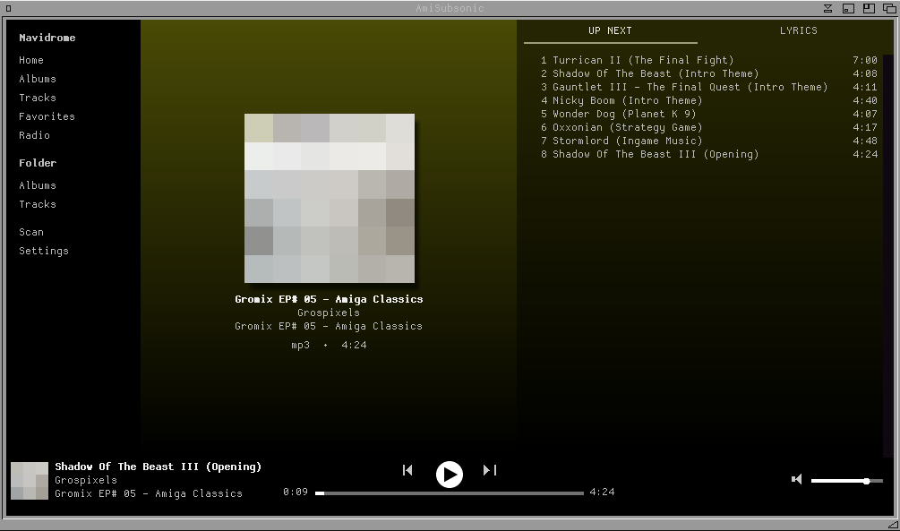
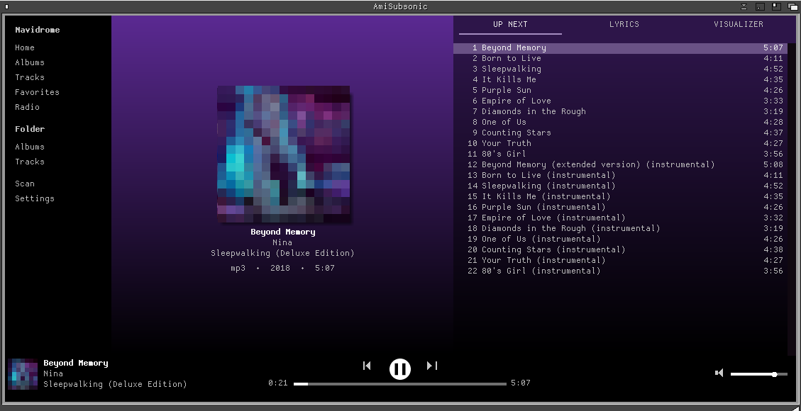
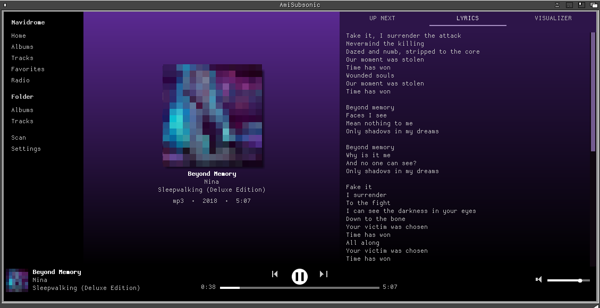
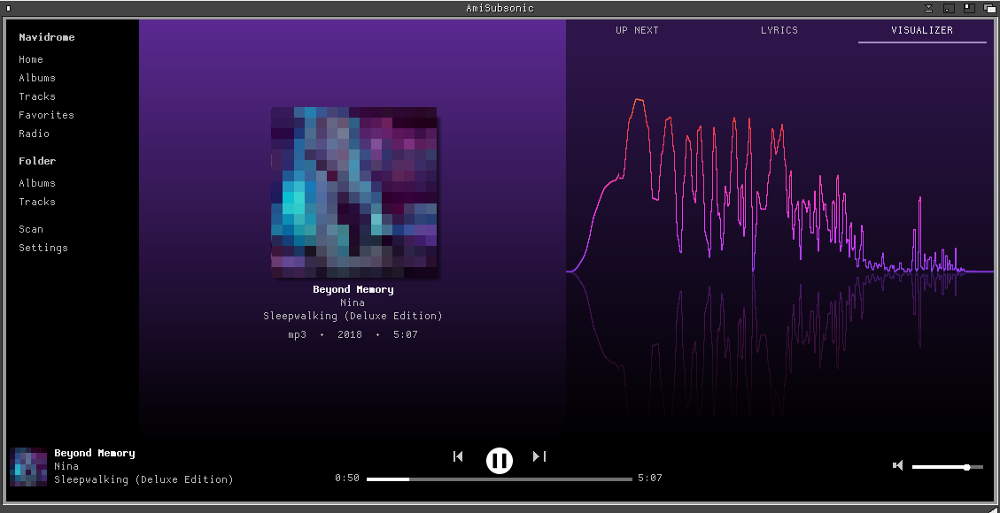

# AmiSubsonic

A beautiful music player for the Amiga, for **Navidrome / Subsonic** servers
and your **own MP3 files**. Version 0.2.



| | |
|---|---|
|  |  |
| **UP NEXT** - the album, the playing track marked | **LYRICS** - from the server, or from lrclib.net |



**VISUALIZER** - spectrum of what you hear, coloured from the cover.
The cover art in these shots is pixelated on purpose.

[English](#english) · [Deutsch](#deutsch)

---

## English

### Features

- Streams from any Navidrome or Subsonic server, over http or https (AmiSSL)
- Plays local MP3 files from a folder of your choice, grouped into albums
- Album cover wall, cover art in true colour, cached on disk
- Colours follow the cover: background and lists take on its main colour
- Lyrics from the server, or from lrclib.net when the server has none
- Internet radio stations of the server, with the current title (MP3 and AAC/HE-AAC streams)
- Visualizer tab: spectrum of what you hear, coloured from the cover, with
  reflection; 15/20/30/60 fps or off, in Settings
- Home, Albums, Tracks, Favorites, Radio, plus Folder/Albums and Folder/Tracks
- Own player: pause, seek within a track, queue, next/previous
- Optional own screen

### Requirements

- AmigaOS 3.1 or 3.2, 68020 or better, no FPU needed
- **A fast Amiga** - MP3 decoding needs a lot of CPU (PiStorm, 68060,
  accelerator or emulator). A plain 68020/030 is too slow.
- **RTG graphics with 24 bit** (CyberGraphX compatible)
- MUI 3.8 or newer
- TCP/IP stack with `bsdsocket.library`, **AmiSSL v5** for https
- **AHI**
- **mpega.library** - Aminet `util/libs/mpega_library.lha` (not included)
- `picture.datatype` V43 and a JPEG datatype for the covers

### Installation

1. Copy the `AmiSubsonic` drawer to your hard disk (not RAM: - the cover
   cache lives next to the program, in `Cache`).
2. Start AmiSubsonic and open **Settings**: server address, user name,
   password. Optionally a folder with your own MP3 files and the AHI unit.

Settings are stored in `ENVARC:AmiSubsonic/AmiSubsonic.prefs`. The password
is stored there in plain text - the Subsonic protocol needs it for every
request.

### Notes

- AAC radio is decoded with the Helix fixed-point decoder (ADTS streams,
  HE-AAC included; HE-AAC v2 plays in mono). Stations in other formats are
  greyed out once they have been tried.
- WinUAE / Amiberry: coloured stripes in the covers come from the JIT -
  switch the JIT off.
- The visualizer costs about 12 % of a PiStorm at 30 fps and roughly 30 % at
  60 fps. It only computes while its tab is visible; "Off" leaves a flat line.
- `AmiSubsonicCLI` is a shell tool for testing without the interface.

### Building

Cross-compiled with [m68k-amigaos-gcc](https://github.com/AmigaPorts/m68k-amigaos-gcc):

```sh
make                 # AmiSubsonic + AmiSubsonicCLI
make check-fpu       # proves no FPU instruction is in the binaries
make TOOLCHAIN=/path/to/m68k-amigaos-gcc
```

Not in this repository, because their licences do not allow it: the MUI
developer headers (put them under `vendor/mui/include/`) and
`libraries/mpega.h` from the mpega archive (under
`vendor/mpega/include/libraries/`). The gcc inline header for mpega.library
is included.

### Licence

MIT, see [LICENSE](LICENSE). `muistubs.c` comes from
[amimcp](https://github.com/thomas-luebker/amimcp) and is Apache 2.0
([LICENSE-Apache-2.0](LICENSE-Apache-2.0)). The AAC decoder in
`vendor/helix-aac/` is the Helix DNA decoder by RealNetworks under the
RealNetworks Public Source License ([RPSL.txt](vendor/helix-aac/RPSL.txt));
origin and the one change are listed in
[README.amiga](vendor/helix-aac/README.amiga).

This program is vibe coded: I described what it should do, an AI wrote the
code, and I tested and decided what stayed in.

Tested on an A500 with PiStorm (AmigaOS 3.2) and in WinUAE / Amiberry
(Workbench 3.1).

---

## Deutsch

### Funktionen

- Spielt von jedem Navidrome- oder Subsonic-Server, über http oder https (AmiSSL)
- Spielt eigene MP3-Dateien aus einem wählbaren Verzeichnis, nach Alben geordnet
- Bildwand mit Albencovern, Cover in Truecolor, auf Platte zwischengespeichert
- Farben passen sich dem Cover an: Hintergrund und Listen übernehmen seine Hauptfarbe
- Liedtexte vom Server oder von lrclib.net, wenn der Server keine hat
- Internetradio-Sender des Servers mit dem laufenden Titel (MP3- und AAC/HE-AAC-Ströme)
- Visualizer-Reiter: Spektrum des Gehörten, eingefärbt nach dem Cover, mit
  Spiegelung; 15/20/30/60 Bilder je Sekunde oder aus, in den Einstellungen
- Home, Albums, Tracks, Favorites, Radio, dazu Folder/Albums und Folder/Tracks
- Eigener Abspieler: Pause, Springen im Titel, Warteschlange, vor/zurück
- Wahlweise eigener Bildschirm

### Voraussetzungen

- AmigaOS 3.1 oder 3.2, 68020 oder besser, keine FPU nötig
- **Ein schneller Amiga** - MP3 dekodieren braucht viel Rechenleistung
  (PiStorm, 68060, Turbokarte oder Emulator). Ein einfacher 68020/030
  ist zu langsam.
- **RTG-Grafik mit 24 Bit** (CyberGraphX-kompatibel)
- MUI 3.8 oder neuer
- TCP/IP-Stack mit `bsdsocket.library`, **AmiSSL v5** für https
- **AHI**
- **mpega.library** - Aminet `util/libs/mpega_library.lha` (nicht enthalten)
- `picture.datatype` V43 und ein JPEG-Datatype für die Cover

### Installation

1. Die Schublade `AmiSubsonic` auf die Festplatte kopieren (nicht ins RAM:
   - der Cover-Cache liegt neben dem Programm, in `Cache`).
2. AmiSubsonic starten und **Settings** öffnen: Serveradresse, Benutzername,
   Passwort. Wahlweise ein Verzeichnis mit eigenen MP3-Dateien und die AHI-Unit.

Die Einstellungen liegen in `ENVARC:AmiSubsonic/AmiSubsonic.prefs`. Das
Passwort steht dort im Klartext - das Subsonic-Protokoll braucht es bei
jeder Anfrage.

### Hinweise

- AAC-Radio dekodiert der Helix-Festkommadekoder (ADTS-Ströme, auch
  HE-AAC; HE-AAC v2 spielt in Mono). Sender in anderen Formaten werden nach
  dem ersten Versuch grau.
- WinUAE / Amiberry: bunte Striche in den Covern kommen vom JIT - JIT
  abschalten.
- Der Visualizer kostet auf einer PiStorm rund 12 % bei 30 und etwa 30 % bei
  60 Bildern je Sekunde. Er rechnet nur, solange sein Reiter zu sehen ist;
  „Off“ zeigt eine ruhende Linie.
- `AmiSubsonicCLI` ist ein Shell-Werkzeug zum Testen ohne Oberfläche.

### Bauen und Lizenz

Siehe den englischen Teil: gebaut wird mit m68k-amigaos-gcc (`make`,
`make check-fpu`), die MUI-Header und `libraries/mpega.h` muss man selbst
beschaffen. Lizenz MIT, `muistubs.c` Apache 2.0, der AAC-Dekoder in
`vendor/helix-aac/` steht unter der RealNetworks Public Source License.

Dieses Programm ist „vibe coded“: Ich habe beschrieben, was es tun soll,
eine KI hat den Code geschrieben, und ich habe getestet und entschieden,
was bleibt.

Getestet auf einem A500 mit PiStorm (AmigaOS 3.2) und in WinUAE / Amiberry
(Workbench 3.1).

---

Author: radi7777 (radi777 on Aminet)
